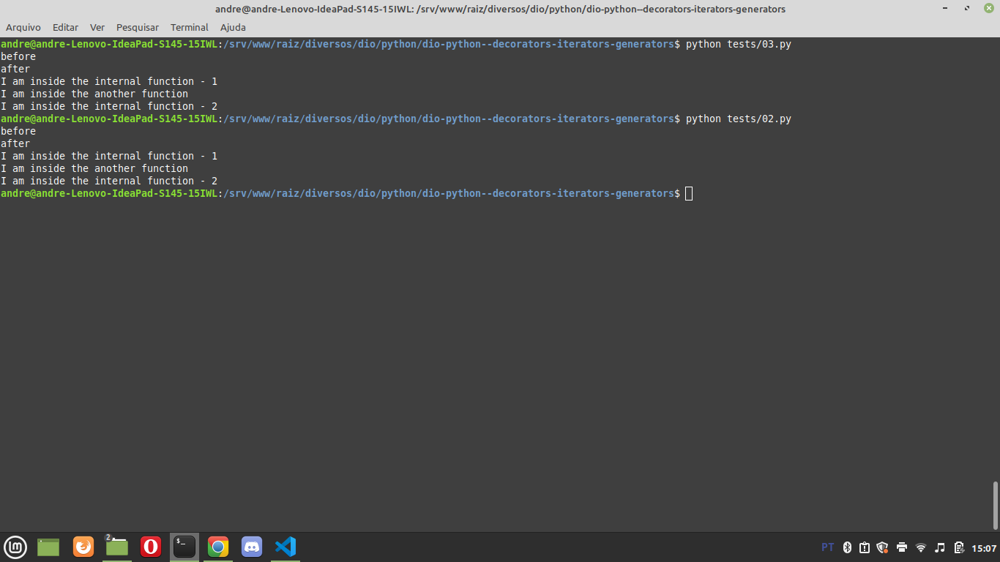

# Introduction

Please see this simple example:


In Python as, you could see, we can pass a function as argument of another function. Teacher said that in Python, functions are objects of the first class.

Teacher also said that we can return a function in another function without executing it.

Teacher also showed that we can have a function inside another function:


Also teacher said that we can cascade function inside another function in more levels.

You can see in the next example how to return a function without executing it and how to pass parameters to it:


Teacher created a code similar a switch/case using **match**:


# Decorator


Please see this example. Teacher showed a similar example in the class:

```python
def my_decorator(func):
    print("before")
    def internal():
        print("I am inside the internal function - 1")
        func()
        print("I am inside the internal function - 2")
    print("after")
    return internal

def another_function():
    print("I am inside the another function")

dec = my_decorator(another_function)
dec() # I need to execute the returned function!
```

You can see in the next example the same output using a **syntax suggar**: 

```python
def my_decorator(func):
    print("before")
    def internal():
        print("I am inside the internal function - 1")
        func()
        print("I am inside the internal function - 2")
    print("after")
    return internal

@my_decorator
def another_function():
    print("I am inside the another function")

another_function()
```

You can see in the next image that the output is still the same:




[class](https://web.dio.me/course/45074cc8-2bab-4d9e-bb95-7fb7c99c29d2/learning/0418aa57-39a3-4f7b-8717-acd5266477a6?autoplay=1&back=%2Ftrack%2Fformacao-python-fundamentals&moduleId=undefined&tab=undefined) - 2:33 (current stage in the video)