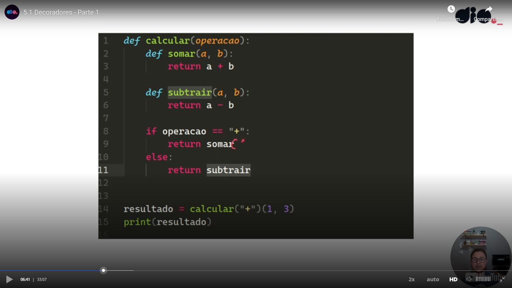

# Introduction

Please see this simple example:

In Python as, you could see, we can pass a function as argument of another function. Teacher said that in Python, functions are objects of the first class.

Teacher also said that we can return a function in another function without executing it.

Teacher also showed that we can have a function inside another function:

Also teacher said that we can cascade function inside another function in more levels.

You can see in the next example how to return a function without executing it and how to pass parameters to it:

Teacher created a code similar a switch/case using **match**:

# Decorator

